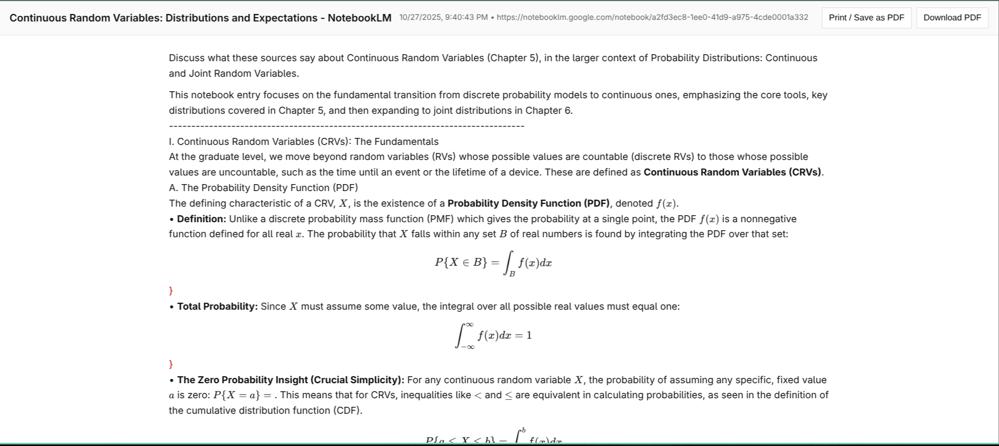
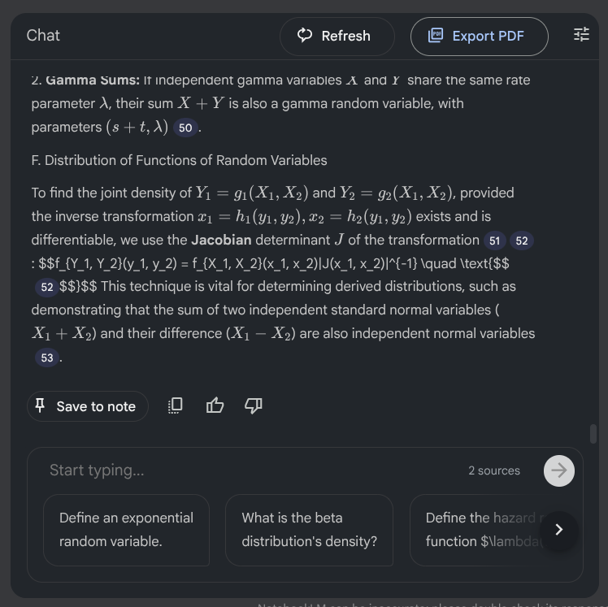

# NotebookLM - PDF (with Math)

## Screenshots

## Features
- Export NotebookLM chats/notes to a print-friendly page or downloadable PDF.
- KaTeX render for $$ math $$, toolbar button

## Project structure
- `manifest.json`
- `'src/`(content scripts, popup, print, assets, vendor bundles)
- `src/scripts/pack.sh` (builds `dist/notebooklm-export.zip`)
- `docs` (screenshots, additional documentation)

## Installation for contributors
- `git clone git@github.com:dylanmccavitt/notebooklm-exporter.git`
- `npm install` (only needed if you plan to run scripts)
- Load unpack: chrome://extensions -> Developer mode -> Load unpacked -> repo root.

## Dev workflow
1. Make edits under `src/...`.
2. Reload the extension in `chrome://extension` to test.
3. Optional: `bash src/scripts/pack.sh` to generate the zip for the web store. 

## License

## Support / Issues
Link